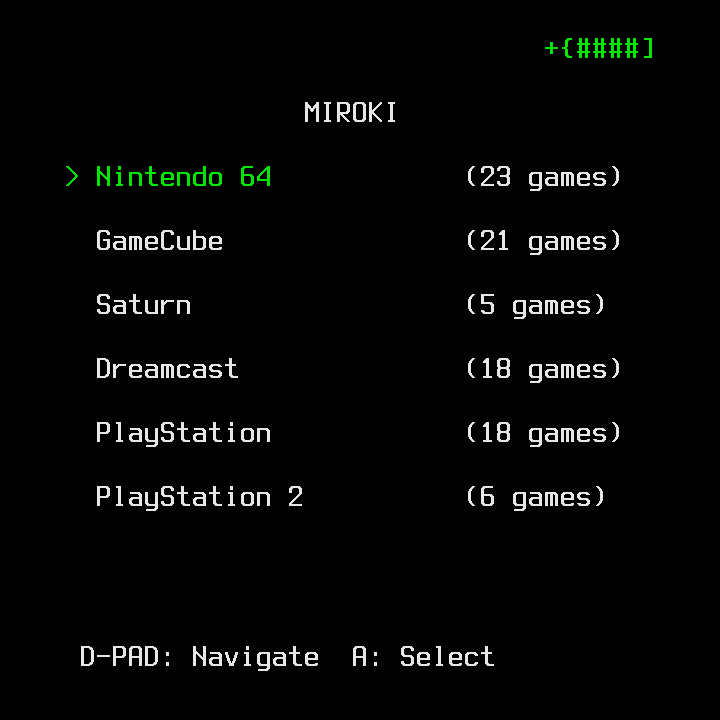
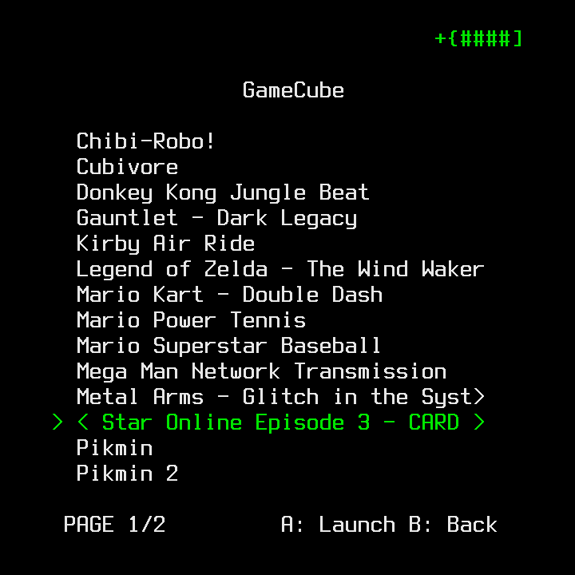

# MIROKI - Minimal Rotate Kiosk (Sibling to MIMIKI)

A minimal emulation platform for the Anbernic RG Rotate.
MIROKI provides a lightweight Linux OS image with a custom ncurses-based launcher
and pre-configured emulators for N64, GameCube, Saturn, Dreamcast, PS1, and PS2.

---

## UI Previews

 

---

## Installation

**A Linux-capable SPL must be installed for SD Card booting to work!**
**If you know yours is installed already, skip immediately to step 2!**

1. Download the `spl-flasher.zip` file from Releases, extract it, and read
the contained README.txt ***CAREFULLY*** and ***THOROUGHLY***

2. Download the latest `miroki-sdcard.img` from Releases and use your 
preferred image flashing software to write the image to the target SD Card.

You can also build the image directly on your machine by following the steps laid
out under the `Build Requirements` section below and the sections beneath it.

---

## SD Card Setup

Place your flashed MIROKI image in the SD slot.
ROMs and game assets are stored on the same card under the appropriate directories.
You will need to boot your MIROKI image at least once to populate the GAMES partition.

### Game Directory Structure

The following directories are created on your SD card on first boot and
the launcher scans these directories automatically every subsequent boot.

| Directory | System        | Supported Formats               | Notes                             |
|-----------|---------------|---------------------------------|-----------------------------------|
| `/n64`    | Nintendo 64   | `.z64`, `.n64`, `.v64`          |                                   |
| `/gc`     | GameCube      | `.rvz`, `.iso`, `.gcz`          |                                   |
| `/stn`    | Saturn        | `.chd`, `.iso`, `.bin`/`.cue`   | BIOS files required under `/data/bios` |
| `/dc`     | Dreamcast     | `.chd`, `.gdi`, `.cdi`          | BIOS files required under `/data/bios` |
| `/ps1`    | PlayStation   | `.chd`, `.pbp`, `.bin`/`.cue`   | BIOS files required under `/data/bios` |
| `/ps2`    | PlayStation 2 | `.chd`, `.cso`, `.iso`          | BIOS files required under `/data/bios` |

Two further directories are created for shared state:

| Directory      | Purpose                                            |
|----------------|----------------------------------------------------|
| `/data/bios`   | BIOS images for Saturn, Dreamcast, PS1, and PS2    |
| `/data/.cache` | Emulator caches and shader/state data              |
| `/data/.config`| Per-emulator config, seeded from defaults on boot  |

---

## System-wide Hotkeys

| Key Combo | Effect                        |
|-----------|-------------------------------|
| M + Start | Exit to Menu                  |
| M + Aux*  | Toggle DPAD <> Analog input   |
| M + Select| Save State                    |
| M + L1    | Load State                    |
| M + VolUp | Brightness Up                 |
| M + VolDn | Brightness Down               |
| Lid       | Sleep/Wake                    |
| Tap Pwr   | Sleep/Wake                    |
| Hold Pwr  | Exit+Pwroff (!DOES NOT SAVE!) |

*Aux is the small circular button on the right side of
the device, beneath the power button.

---

## Supported Emulators

| System        | Emulator     |
|---------------|--------------|
| N64           | mupen64plus  |
| GameCube      | Dolphin      |
| Saturn        | yabasanshiro |
| Dreamcast     | Flycast      |
| PlayStation   | PCSX-ReARMed |
| PlayStation 2 | ARMSX2       |

---

## Build Requirements

- Linux host with standard build tools
- ARM64 cross-compilation tools and libraries
- Root access for image creation and flashing

---

## Cloning

The project uses Git submodules for the kernel, bootloader, libraries, and emulators.
Clone with all submodules in one step:

```sh
git clone --branch rg-rotate --recurse-submodules https://github.com/beebono/mimiki.git
cd mimiki
```

If you have already cloned without `--recurse-submodules`, initialize the submodules manually:

```sh
git submodule update --init --recursive
```
NOTE: The mupen64plus directory may throw an error here.
If so, you will need to initialize each other submodule manually rather than recursively.

---

## Build/Flashing Steps

Run `make help` to display all available build targets:

```sh
make help
```

The standard build sequence is:

```sh
make tools        # Build libraries and utilities (SDL2, busybox, etc.)
make boot         # Build U-Boot and Linux kernel
make launcher     # Build the MIROKI ncurses launcher
make emulators    # Build the standalone emulators
make rootfs       # Assemble the root filesystem
make image        # Create a bootable SD card image (requires root)
```

Or build everything in one command:

```sh
make build-all
```

Once the image is built, you can flash it to an SD card:

```sh
make flash SDCARD=/dev/sdX
```

Replace `/dev/sdX` with the actual block device path of your SD card.
This operation requires root and will **overwrite all data** on the target device.
